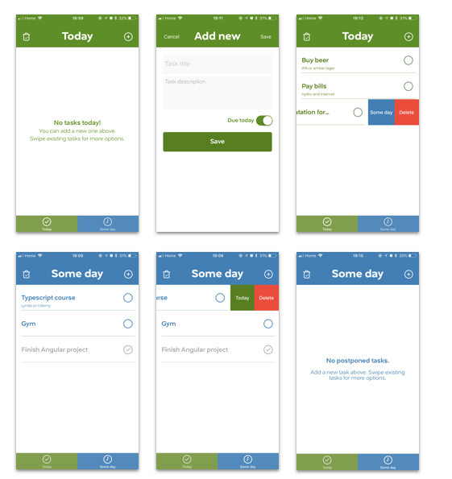

# iOS To Do app - Todayish

MAPD 2017-18. iOS ToDo app with CoreData storage.

**Features:**
* create task with title, description and due date (today or some day)
* two screens / lists for 'Today' and 'Some day'
* swipe tasks to move them between 'Today' and 'Some day' or delete
* completed tasks move to bottom
* delete completed tasks with a dedicated button

## App screenshots

